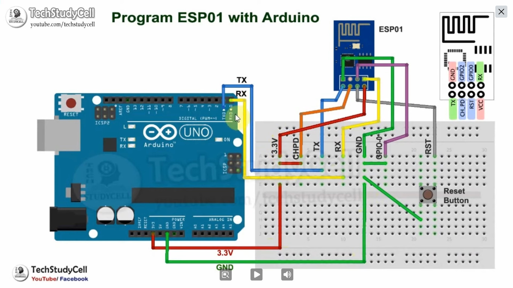
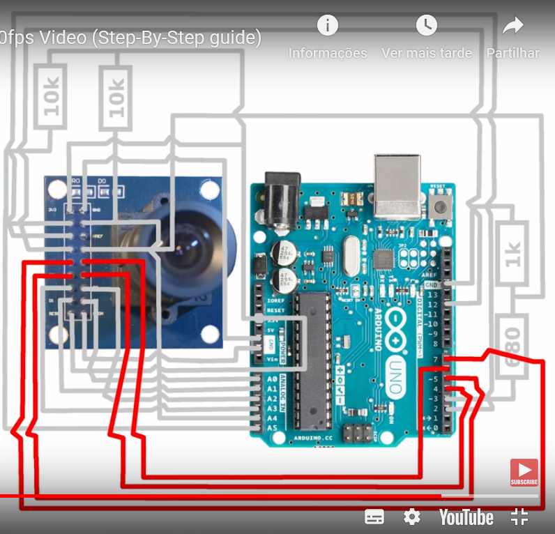

This project is about secure camera with a LCD display, it includes sensors that when activated will send a notification via mobile App.
The github repository will serve to save all the code made in the project.
Made by Mário Costa and Bruno Silva
LEEC students

Project Desing :

Project installation : 

LCD TFT 144:
  Vin - 5V
  GND - GND
  SCK - 13
  SI - 11
  TCS - 10
  RST - 9
  D/C - 8
  
Camara module OV7674:
  

ESP8266 ESP-01:

